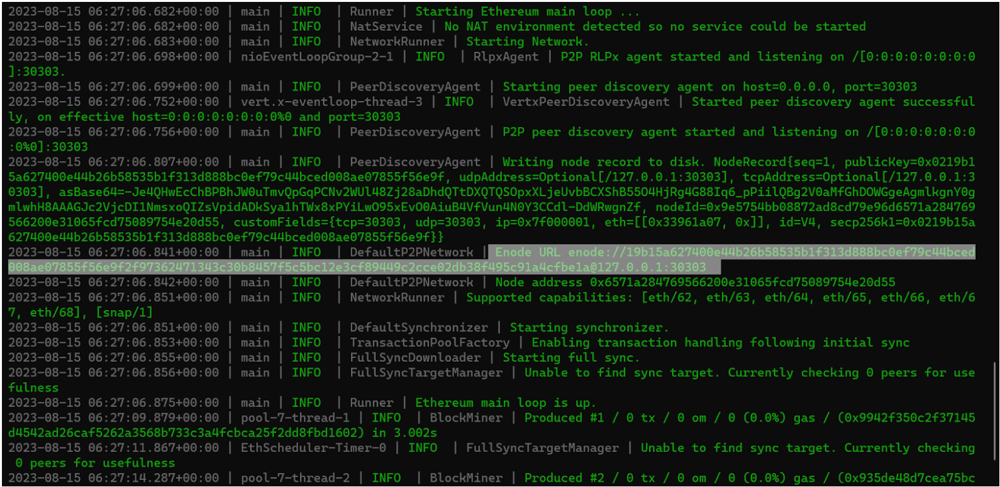
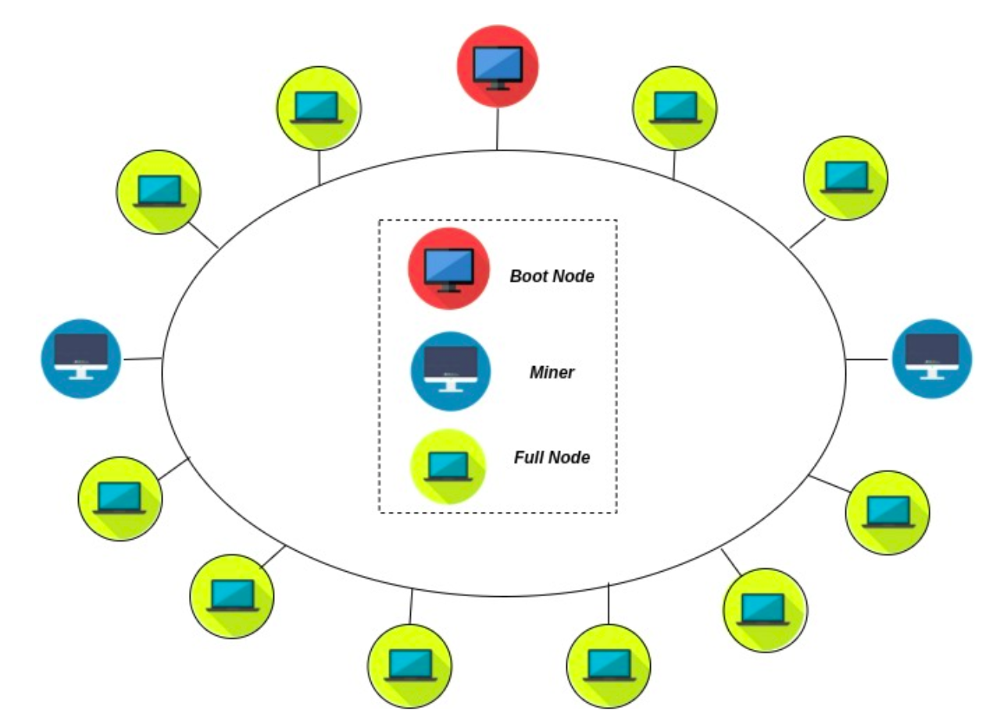
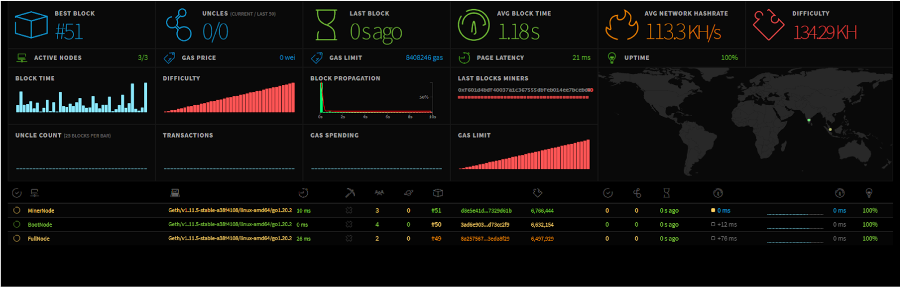
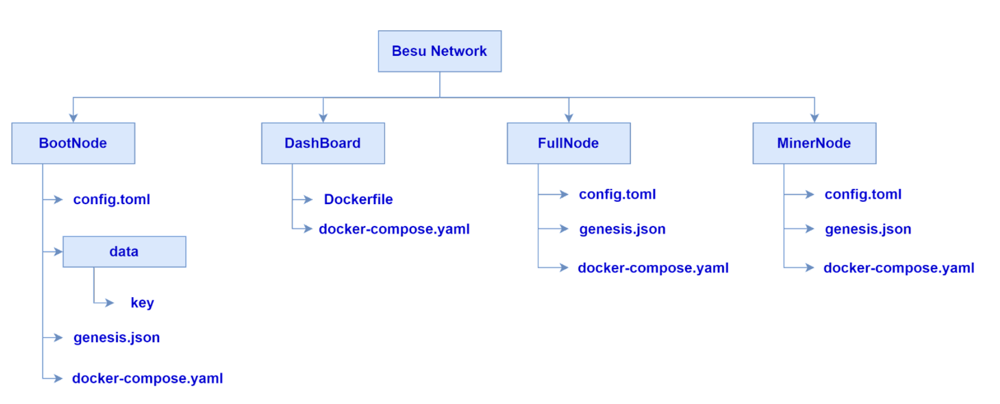

# ENA Notes

> [!TIP]
> Official Besu [documentation](https://besu.hyperledger.org/)

> [!NOTE]
> This is a note taken during the self-paced exploration of **Ethereum Network Administrator (ENA)**.

> [!CAUTION]
> This is just an overview. For comprehensive and detailed instructions, always refer to the official documentation.

## Need for Building Customizable Ethereum Networks

Private Ethereum networks, or customizable Ethereum networks, have various uses in the blockchain ecosystem:

1. Testing and Development: Developers use private networks to test and develop smart contracts and applications without using real Ether or impacting the public mainnet.

2. Privacy: Private networks can keep transactions and contracts private, unlike public blockchains.

3. Scalability: Private networks can process transactions more quickly and cheaply than the congested Ethereum mainnet.

4. Control: Users can define the blockchain’s rules, making them crucial for permissioned blockchains.

5. Interoperability and Integration: Private networks can be built to cater to an organization’s existing IT systems.

6. Learning and Education: Creating a private Ethereum network can be a great way to learn blockchain development in a low-risk environment.

It's important to note that private networks do not offer the same level of security, decentralization, or robustness as the public Ethereum network. The appropriate solution should be chosen based on the specific needs and trade-offs of a given project or organization.

## Layer 1 and Layer 2 Solutions

### Ethereum-Compatible Layer 1 Chains

Layer 1 chains are independent blockchains that operate on their own mainnet and do not rely on another blockchain for their operations. They provide the base layer of the blockchain architecture, handling all on-chain transactions and smart contract executions.

Networks like Binance Smart Chain (BSC), Tron, Celo, Avalanche, and Genesis have forked or re-engineered versions of the Ethereum blockchain to create their own standalone networks, often referred to as Layer 1 chains. These chains adapt Ethereum's smart contracts and decentralized applications to their specific needs, tweaking parameters for speed, decentralization, or security. They are EVM-compatible, allowing developers to deploy applications using the same codebase as Ethereum.

### Layer 2 chains & Scaling solutions

Layer 2 chains, also known as Layer 2 scaling solutions, are protocols built on top of the Ethereum blockchain to improve its scalability and efficiency. Examples include Polygon, xDai, Optimism, Arbitrum, and StarkNet. These solutions enable faster and cheaper transactions while maintaining the security of the Ethereum network.

Layer 2 chains like Polygon, xDai, Optimism, Arbitrum, and StarkNet are built on top of Ethereum to improve scalability, enabling faster and cheaper transactions while maintaining the security of the Ethereum network.

## Ethereum Enterprise Alliance (EEA)

The Ethereum Enterprise Alliance (EEA) was formed to empower organizations to embrace the Ethereum blockchain for their specific enterprise requirements. Leveraging the native features of Ethereum, enterprises can streamline their business operations, enhance security and auditability, and foster improvements in transparency throughout their processes.

## Ethereum Client

An Ethereum client is vital software that connects to create the Ethereum network. It is the software backbone of the Ethereum blockchain, enabling machines to connect, execute transactions, store data, and support decentralized application development. After "The Merge" upgrade, Ethereum consists of two distinct layers: the execution layer (EL) and the consensus layer (CL).

### Execution Layer (EL)

The execution layer is responsible for processing transactions and executing smart contracts within the Ethereum Virtual Machine (EVM). It handles the state of the blockchain, including account balances, contract code, and storage. Execution clients, such as Geth, Nethermind, Hyperledger Besu, and Erigon, manage this layer by validating and executing transactions, maintaining the state database, and providing APIs for developers to interact with the blockchain.

### Consensus Layer (CL)

The consensus layer implements the proof-of-stake (PoS) consensus algorithm, which ensures the network's security and agreement on the blockchain's state. Consensus clients, such as Prysm, Lighthouse, Teku, Nimbus, and Lodestar, manage this layer by proposing and validating new blocks, participating in the consensus process, and maintaining the chain's finality. The consensus layer coordinates validators, who are responsible for proposing and attesting to blocks, ensuring the network reaches consensus on the blockchain's state.

These clients enable the seamless operation of the Ethereum blockchain by working together to process transactions, execute smart contracts, and maintain consensus across the network.

These clients encompass a range of essential components, including:

1. Execution Environment: The Ethereum client provides an execution environment for processing transactions within the blockchain, ensuring that smart contracts and dApps function as intended.

2. Storage: Ethereum clients have built-in storage capabilities to persistently store data relevant to transaction execution, ensuring the integrity and continuity of the blockchain network.

3. Peer-to-Peer Network: Peer-to-peer (P2P) networking is crucial for Ethereum clients as it enables communication and synchronization with other network nodes. P2P networking enhances decentralization and consensus mechanisms by sharing information and collectively validating transactions.

4. APIs for Application Developers: Ethereum clients provide APIs for developers to interact with the blockchain, enabling decentralized app development, blockchain data querying, and transaction submission.

### Hyperledger Besu

> [!NOTE]
> For more information visit official [wiki](https://lf-hyperledger.atlassian.net/wiki/spaces/BESU/overview).

Hyperledger Besu is an Ethereum client under Hyperledger Foundation’s projects. It serves as a collaborative platform for open-source blockchain projects and associated tools, aiming to advance the application and understanding of blockchain across different sectors.

Besu not only serves public Ethereum networks as an Execution client but is also tailored to fit private permissioned ones. One of its unique features is its adaptable EVM (Ethereum Virtual Machine) implementation, which allows it to support various consensus algorithms and network configurations.

Hyperledger Besu offers compatibility with

1. **Proof of Work (PoW)**
2. **Proof of Authority (PoA)**:
   - This includes IBFT 2.0 (Istanbul BFT), QBFT (Quorum Byzantine Fault Tolerance), and Clique variants.
   - PoA algorithms rely on a selected group of approved validators who take turns creating blocks and securing the network.
   - This approach ensures high transaction throughput, low latency, and efficient network governance, making it well-suited for consortium-based blockchain networks.
3. **Proof of Stake**: Alongside a consensus client, Besu can be used to connect to and participate in Ethereum Mainnet proof-of-stake.
4. Hyperledger Besu offers comprehensive permissioning schemes designed explicitly for use in consortium environments. These permissioning mechanisms allow organizations to control access, define roles and responsibilities, and establish governance rules within the network. Hyperledger Besu facilitates secure collaboration and fosters trust among consortium members by providing granular control over participants’ actions and data visibility. Now that we’ve covered the theoretical aspects let’s explore the practical side of creating customized Ethereum networks.

### Unique Features of Hyperledger Besu

1. **Adaptable EVM Implementation**: Supports various consensus algorithms and network configurations.
2. **Compatibility with Public and Private Networks**: Can serve both public Ethereum networks and private permissioned ones.
3. **Comprehensive Permissioning Schemes**: Designed for consortium environments, allowing granular control over participants’ actions and data visibility.
4. **Support for Multiple Consensus Algorithms**: Includes Proof of Work (PoW), Proof of Authority (PoA) with IBFT 2.0, QBFT, Clique, and Proof of Stake (PoS).

### Practical Steps to Use Hyperledger Besu

Hyperledger Besu is an Ethereum client under Hyperledger Foundation’s projects. It serves as a collaborative platform for open-source blockchain projects and associated tools, aiming to advance the application and understanding of blockchain across different sectors.

Now that we’ve covered the theoretical aspects, let’s explore the practical side of creating customized Ethereum networks.

## Installing Hyperledger Besu

To install Hyperledger Besu, ensure your system has Java installed since Besu is Java-based. This tutorial is tailored for Ubuntu systems.

1. ### Install Java

   ```sh
   sudo apt update
   sudo apt install openjdk-21-jdk
   ```

2. ### Verify the installation

   ```sh
   java --version
   ```

3. ### Download and set up Hyperledger Besu

   1. **Install Prerequisites**:

      Ensure you have Java 21 installed.

   2. **Download Besu**:

      Navigate to the directory where you want to install Besu and download the required release from the [official Hyperledger Besu Releases](https://github.com/hyperledger/besu/releases). For this guide, we'll use Hyperledger Besu 23.4.4.

   3. **Extract the Archive**:

      Extract the downloaded archive:

      ```sh
      tar -xvf besu-<version>.tar.gz
      ```

   4. **Set Up Environment Variables**:

      Add Besu to your PATH by editing your `.bashrc` or `.zshrc` file:

      ```sh
      echo 'export PATH=$PATH:/path/to/besu/bin' >> ~/.bashrc
      source ~/.bashrc
      ```

      here, as we are using Besu 23.4.4 and extracted at root then path is `PATH=$PATH:~/besu23.4.4/bin`

   5. **Verify Installation**:

      Check if Besu is installed correctly by running:

      ```sh
      besu --version
      ```

   6. **Run Besu**:

      Restart the system to reflect the updates. You can now run Besu with the default options:

      ```sh
      besu
      ```

## Setting Up Single Node Private Ethereum Network

> [!TIP]
> Check out the official tutorials [Private Network QuickStart](https://besu.hyperledger.org/stable/private-networks/tutorials/quickstart)

> [!NOTE]
> Ethash Consensus Algorithm
> Ethash was Ethereum's proof-of-work mining algorithm. For more details visit this [link](https://ethereum.org/en/developers/docs/consensus-mechanisms/pow/mining/mining-algorithms/ethash/).

1. Make sure prerequisites are met and Hyperledger Besu is installed.

   ```sh
   besu --version
   ```

2. Create a New Folder and use that directory: (optional)

   ```sh
   mkdir PrivateNetwork
   cd PrivateNetwork
   ```

3. Create a configuration file.
4. Start the Node.
5. Interaction with the Node using JSON-RPC calls or command-line interfaces to send transactions, deploy smart contracts, or request blockchain data.

## Genesis Block Configuration

The genesis block is the foundational starting point of any blockchain, ensuring the integrity and continuity of the entire system. It’s hardcoded into network nodes, making it a critical point of trust. Each block contains the hash of its predecessor, so tampering with the genesis block invalidates the entire blockchain.

## Besu Genesis Block Configuration

By default, Besu creates the mainnet’s genesis block. For a private network, a distinct genesis block is required. Below is the configuration for a Proof of Work-based network.

### Steps to Create Genesis File

1. Create a file named `genesis.json` in the `PrivateNetwork` folder.
2. Copy the content below and replace the highlighted section with your account address.

```json
{
  "config": {
    "berlinBlock": 0,
    "ethash": {
      "fixeddifficulty": 1000
    },
    "chainID": "1100001"
  },
  "gasLimit": "0x1000000",
  "difficulty": "0x10000",
  "contractSizeLimit": "24576",
  "alloc": {
    "<your_account_address>": {
      // Ensure you have access to this account in MetaMask or any other wallet. In MetaMask, go to the account details, copy the account address, and paste it here.
      "balance": "90000000000000000000000"
    }
  }
}
```

#### Key Configuration Parameters

- **berlinBlock:**
  In Besu private networks, the `berlinBlock` parameter marks Ethereum protocol changes. Setting it to `0` ensures the network uses the latest Ethereum protocol from its genesis block.

- **chainID:**
  Ethereum uses two identifiers: a network ID for peer-to-peer communication, and a chain ID for transaction signing. These IDs should be numerical and not start with zero to avoid errors.

- **gasLimit:**
  Sets the maximum gas cost per block, dictating the extent of EVM computation permissible within a single block.

- **ethash:**
  Indicates the Proof of Work algorithm. The `fixeddifficulty` field maintains constant network difficulty for testing environments. For production networks, it's recommended to set a low difficulty in the genesis file for Ethash to adjust based on hashrate.

- **alloc:**
  Specifies addresses and their initial balances in wei. Include an address you can access with a private key, such as one from MetaMask.

> [!NOTE]
> Besu doesn’t support private key management. So make use of a familiar wallet like MetaMask.

## Running a Private Node

To run a private node, use the following command after replacing the `<your_account_address>`:

```sh
besu --identity="NodeA" --network-id=1000001 --data-path=Node1/data \
--genesis-file=./genesis.json --rpc-http-enabled --rpc-http-host="0.0.0.0" \
--rpc-http-port="8545" --rpc-http-api=ADMIN,ETH,NET,MINER,WEB3 --host-allowlist="*" \
--rpc-http-cors-origins="all" --miner-enabled --miner-coinbase="<your_account_address>"
```

### Command Parameters

- **identity:** Name of the node, e.g., NodeA.
- **network-id:** Numeric identifier for the network (e.g., 1000001).
- **data-path:** Directory for storing blockchain data.
- **rpc-http-enabled:** Enables RPC communication.
- **rpc-http-port:** Default port 8545.
- **host-allowlist:** Accepts a comma-separated list of hostnames, \* for any host.
- **rpc-http-cors-origins:** Accepts cross-origin requests, all for all origins.
- **rpc-http-api:** Lists APIs accessible through RPC (e.g., ADMIN, ETH, NET, MINER, WEB3).
- **miner-coinbase:** Account for mining rewards, replace with your account address.
- **miner-enabled:** Activates mining on the node.

Execute the command to start the node. The node will begin mining and its status will be displayed in the console.

> [!NOTE]
> Mining is resource-intensive and may cause high CPU utilization. Ensure your system has adequate resources to avoid performance issues.

## Ethereum Node Functionality Testing

### Testing Node Operation

Node functionality can be verified by deploying a simple smart contract. The example contract below comes from the Remix IDE.

#### Example Storage Contract Implementation

```solidity
// SPDX-License-Identifier: GPL-3.0

pragma solidity >=0.8.2 <0.9.0;

/**
 * @title Storage
 * @dev Store & retrieve value in a variable
 * @custom:dev-run-script ./scripts/deploy_with_ethers.ts
 */
contract Storage {

    uint256 number;

    /**
     * @dev Store value in variable
     * @param num value to store
     */
    function store(uint256 num) public {
        number = num;
    }

    /**
     * @dev Return value
     * @return value of 'number'
     */
    function retrieve() public view returns (uint256){
        return number;
    }
}
```

#### Deploying a Smart Contract on Private Ethereum Network

**Contract Overview**
A basic Ethereum smart contract that implements a number storage system with the following functionality:

- `store`: Stores a number value on the blockchain
- `retrieve`: Retrieves the stored number from the blockchain

##### Deployment Instructions

**Prerequisites**

- Remix IDE
- MetaMask wallet extension
- Running private Besu network

##### Step-by-Step Deployment Guide

1. **Contract Setup in Remix**

   - Create `Storage.sol` in Remix IDE
   - Copy the contract code into the file
   - Compile using Solidity Compiler

2. **MetaMask Configuration**

   - Connect to private network using these parameters:
     - Network Name: Private Besu
     - RPC URL: http://127.0.0.1:8545
     - Chain ID: 1100001
     - Currency Symbol: PBSU

3. **Contract Deployment**

   - Select "Injected Provider - MetaMask" in Remix
   - Ensure correct account is selected in MetaMask
   - Deploy contract through Remix interface
   - Confirm transaction in MetaMask

4. **Verification**
   - Test contract functionality using Remix's interface
   - Verify both number storage and retrieval operations

> [!TIP]
> Refer to the accompanying [video](https://youtu.be/7fWQzc_eFYo) for guidance.

## Extending Single Node to Multi-Node Network

### Introduction

Expanding our Ethereum network from a single node to a multi-node setup within a single system. Here are the key points:

### Node Roles

#### Boot Node

- Acts as the network coordinator, helping with peer discovery.
- Serves as the gateway for other nodes to join the network.

#### Miner Node

- Validates transactions and participates in the consensus mechanism.
- Important for adding new blocks to the blockchain.
- Note: Usually, only one miner node is used in a multi-node setup on a single system to avoid high CPU usage.

#### Full Node

- Used by participants to send and receive transactions.

#### Archive Nodes

- Maintain a complete copy of the blockchain.
- Mostly passive but can switch to a miner or boot node if needed.

### Modular and Flexible Architecture

- Blockchain's architecture allows a single node to perform multiple roles without interference.
- In smaller/private networks, combining roles helps optimize resources and streamline management.
- In larger public networks (like Ethereum mainnet), roles are distinct to improve efficiency, security, and scalability.

### Extending to Multi-Node Network

In the previous setup, the node functioned primarily as a miner. However, it can also act as a bootnode. This function wasn’t utilized earlier because there were no multiple nodes needing to connect with each other. As the network expands, this node will act as the entry point for new nodes, allowing them to connect and integrate into the network.

First, to connect to the bootnode, the enode ID is required. The enode ID is a unique identifier for each node in an Ethereum network, similar to an IP address. It allowing other nodes to locate and connect to it. You can obtain the enode ID from the console log of the previously run node. Look for a line in the log that starts with "Enode URL" or similar, which will display the enode ID in the format `enode://<public_key>@<ip_address>:<port>`.



Next, a new terminal should be opened in the `PrivateNetwork` folder. To start the second node, the following command should be executed. It is quite similar to the command used for the previous node, with differences `--data-path=Node2/data --identity="NodeB"`, `--rpc-http-port "8546"`, and `--p2p-port "30304" --bootnodes="enode_url`:

```sh
besu --network-id 1000001 --data-path=Node2/data --identity="NodeB" --genesis-file=./genesis.json --rpc-http-enabled --rpc-http-host="0.0.0.0" --rpc-http-port "8546" --rpc-http-api=ADMIN,ETH,NET,MINER,WEB3 --host-allowlist="*" --rpc-http-cors-origins="all" --p2p-port "30304" --bootnodes="enode_url"
```

The `data-path` for this command is modified to point to a different directory, and the `identity` and `rpc-http-port` are adjusted to values distinct from those used in the previous node setup. The `p2p-port` for peer-to-peer interactions is also defined, defaulting to 30303 if no value is provided. The initial node is set as the boot node by providing its enode address.

The same command can be used to operate the third node, fourth node, and so forth, simply by adjusting the mentioned parameters.

### Network Functionality Testing

The network is now active. To check the network’s status, several API endpoints are available through the Besu client. The parameter set using `rpc-http-api` was configured to ADMIN, ETH, NET, MINER, WEB3, which are the various API modules available for interaction with the node. For API queries, tools like Postman or Curl can be employed.

To communicate with these endpoints, understanding the request format is essential. The Besu Team provides the necessary request formats, refer [here](https://besu.hyperledger.org/assets/files/postman_collection-1354ef299155a66a6083e20e7571a9d3.json) to learn more. Import this collection into Postman or Curl and experiment with the listed methods by invoking them.

- **admin_peers**: Provides details on the connected remote nodes.
- **net_peerCount**: Indicates the current count of peers connected to the client.
- **net_enode**: Displays the enode URL.

Refer [here](https://besu.hyperledger.org/stable/public-networks/reference/api) for details about other APIs.

### Smart Contract Deployment

To validate the network’s operation, the simple storage smart contract used previously will be deployed.

First, connect the Remix IDE to the full node at URL (8546) via MetaMask and initiate the contract deployment. Set a value for the `number` variable using the `store` function. Note down the contract address. Then, switch the MetaMask connection to the miner node URL (8546). In the ‘Deploy & Run Transaction’ section, input the contract address to access the previously deployed contract. Execute the `retrieve()` function and check the resulting output.

> [!TIP]
> Refer to the accompanying [Video](https://youtu.be/FZs1H-zjUkY)

### Terminating the Node

To shut down the node, use the keyboard interrupt, `Ctrl + C`. While closing the terminal might sometimes work, there are instances where the Java process remains active. This lingering process can prevent the node from restarting, as it utilizes system resources.

## Private Multi-Node Network Configuration

### Introduction

This section covers setting up a custom Ethereum private network across the internet. Instead of using a single device, each node will be on a separate machine. Virtual machine services like Azure or Digital Ocean or AWS can be used for this setup. Alternatively, multiple desktops or laptops can also be used.

### System Configuration

The network was tested with the following setup:

**VM Configuration**

- Processor: 2 CPUs
- RAM: 4 GB
- Storage: 80 GB SSD

**Software Configuration**

- Ubuntu 22.04.3 LTS
- Besu 23.7.1
- Docker version 24.0.5

Before starting, it's important to understand the network architecture. A dashboard will also be introduced to provide an overview of the network's structure and performance.

### Network Architecture

The private network includes one boot node, two miner nodes, and ten full nodes. All nodes in this setup are full nodes. The nodes connect to a single boot node, which is crucial for network operation. Unlike the Ethereum mainnet, which uses multiple boot nodes, this private network needs only one boot node. The boot node helps with peer discovery, ensuring all nodes can communicate and synchronize efficiently.



> [!TIP]
> Use the command `ip addr` in the terminal to get the IP address of a system. Use `ping <IP_address>` to check connectivity to other systems.

### Automation via Containerization

So far, the system has been configured by manually inputting commands sequentially. While this method works, it can become cumbersome and time-consuming, especially when setting up a private network with multiple nodes. To streamline and enhance this process, **Docker** can be leveraged. Docker offers a more efficient way to automate the deployment and operation of each node and the dashboard. By utilizing Docker containers, a consistent environment for each node can be ensured, simplifying the overall setup and making the expansion and management of the network more straightforward and efficient.

Begin by crafting the necessary `docker-compose.yaml` files and `Dockerfiles`. These files are essential for defining and running multi-container Docker applications. By creating these, a structured and efficient deployment of services can be ensured. The `docker-compose.yaml` will allow the specification and management of the services, networks, and volumes needed, while the `Dockerfiles` will detail the environment and instructions for building the containerized applications. This approach will streamline the setup and make it more scalable and manageable in the long run.

To streamline and optimize the network setup, Docker scripts tailored for several components need to be crafted. Here’s a breakdown of the focus areas:

- **Network Dashboard**: Serves as the central monitoring hub, providing a visual representation of the network’s health and performance.
- **Boot Node**: Essential for peer discovery, the boot node acts as the intermediary, ensuring efficient communication and synchronization across the network.
- **Full Node**: These nodes validate and relay transactions, playing a crucial role in maintaining the integrity and functionality of the network.
- **Miner Node**: Dedicated to mining, these nodes validate new transactions and add them to the blockchain, ensuring the network’s continuity and security.

By developing Docker scripts for each component, a more streamlined deployment and management process can be ensured, making the network more robust and efficient.

Start by creating a new directory named "BesuNetwork" or initiate a new repository called "BesuNetwork" and clone it. Inside this directory, construct the following subdirectories:

- Dashboard
- BootNode
- FullNode
- MinerNode

With these folders in place, proceed to craft Docker scripts tailored for each specific subdirectory. Perform each of the following in the corresponding folder.

### Network Dashboard

A visual summary of network activity can be monitored via a dashboard. A dashboard commonly used by the Ethereum community will be utilized for this purpose.



The process begins by crafting Docker scripts tailored for the Network Dashboard. This will leverage a community-driven project named [ethstatus](https://github.com/goerli/ethstats-server). This platform will act as a central hub where all nodes in the network will connect and relay essential information. By integrating with `ethstatus`, a streamlined communication process is ensured, allowing each node to provide the dashboard with vital details for comprehensive monitoring and management of the network’s health and performance.

Initially, the focus will be on constructing the Docker image for the Network Dashboard application. This involves creating a `Dockerfile` to define the necessary parameters and instructions. The `Dockerfile` typically contains instructions for building a Docker image, including the base image to use, environment variables, file copying from the host to the container, dependency installation, and commands to run during image creation. Once built, this image can be used to run containers with the configured environment and application.

```Dockerfile
# Use an official Node.js runtime as the base image
FROM node:latest

# Declare the build argument
ARG WS_SECRET

# Set the working directory inside the container
WORKDIR /usr/src/app

# Clone the git repository
RUN git clone https://github.com/Justinjdaniel/ethstats-server .

# Install dependencies
RUN npm install && \
    npm install -g grunt-cli && \
    npm install grunt –save-dev

# Build the project for monitoring the proof of work
RUN npx grunt pow

# Use the build argument to set the environment variable
ENV WS_SECRET=$WS_SECRET

# Expose port 3000 for the app
EXPOSE 3000

# Command to run the app
CMD ["npm", "start"]
```

After constructing the Docker image for the Network Dashboard application using the `Dockerfile`, the next step is to create a `docker-compose.yaml` file.

```yml
version: '3'
services:
  ethstats-server:
    build:
      context: .
      dockerfile: Dockerfile
      args:
      WS_SECRET: thisIsSecret

    ports:
      - '3000:3000'

    user: '0'
```

This network monitor can be accessed through the address \[vm_machine_ip]:3000. Not only can the local machine access this monitor, but other systems within the network can also view it using the same URL: \[vm_machine_ip]:3000. Once accessed, it provides a comprehensive overview of the network, showcasing details about the nodes, their mining status, and a range of other performance metrics. This visibility ensures a clear understanding of the network’s health and performance at all times.

### Boot Node

Next, the focus shifts to setting up the boot node. This involves creating Docker scripts, a genesis file, and a node configuration file.

The boot node is a foundational element in the network. Its configuration is crucial because it needs to accept connection requests from different machines within the network. This ensures that all nodes, whether full nodes, miner nodes, or others, can connect and synchronize seamlessly. Properly configuring the boot node and ensuring its accessibility lays the groundwork for a robust and interconnected network, where each node can efficiently communicate and share data.

First, the genesis file must be consistent across all nodes. Uniformity is crucial, as any discrepancy in the genesis file will prevent the network from being established.

**genesis.json**

```json
{
  "config": {
    "berlinBlock": 0,
    "ethash": {
      "fixeddifficulty": 1000
    },
    "chainID": "1100001"
  },
  "gasLimit": "0x1000000",
  "difficulty": "0x10000",
  "contractSizeLimit": "24576",
  "alloc": {
    "<your_account_address>": {
      "balance": "90000000000000000000000"
    }
  }
}
```

Next, the Docker Compose file to run the node will be created.

**docker-compose.yaml**

```yaml
# Specify the version of the docker-compose file format
version: '3'

# Define the services (containers) to run
services:
  # Service name
  node:
    # Image to use for this service
    image: hyperledger/besu:latest

    # Name of the container
    container_name: 'BootNode'

    # Restart policy for the container
    restart: unless-stopped

    # Port mappings between the host and the container
    ports:
      - '30311:30311' # TCP port mapping
      - '30311:30311/udp' # UDP port mapping
      - '8500:8500' # Additional TCP port mapping

    # Mount host directories/volumes into the container
    # Mount the current directory to /BootNode/ in the container with
    # read-write permissions
    volumes:
      - .:/BootNode/:rw

    # Command to run when the container starts
    command: --config-file=/BootNode/config.toml

    # Set the user ID for the process inside the container (0 is root)
    user: '0'
```

Both TCP and UDP ports are explicitly exposed because Ethereum uses both protocols for peer discovery. The user is set to root to address certain permission challenges associated with Besu.

Next, the configuration file for the node will be written.

**config.toml**

```toml
nat-method="AUTO"
data-path = "/BootNode/data"
genesis-file = "/BootNode/genesis.json"
network-id = "01000001"

# Connection related
host-allowlist = ["all"]

# P2P related
p2p-port = 30311

# RPC related
rpc-http-enabled = true
rpc-http-port = "8500"
rpc-http-api = ["ADMIN", "ETH", "NET", "TXPOOL", "WEB3", "DEBUG", "TXPOOL", "TRACE", "PLUGINS"]
rpc-http-cors-origins = ["all"]

# ethstats
ethstats="BootNode:thisIsSecret@vm_machine_ip:3000"
```

These parameters mirror those previously provided via the command line but are now consolidated into a `TOML` config file. Some new parameters are also introduced:

- **nat-method**: Specifies the method for NAT (Network Address Translation). "AUTO" means the system will automatically determine the best method, which will be set to Docker.
- **host-allowlist**: Specifies which hosts are allowed to connect. Setting it to \["all"] allows any host to connect.
- **rpc-http-cors-origins**: Specifies the origins for cross-origin requests to the HTTP-RPC server. Setting it to \["all"] allows any origin to make requests.
- **ethstats**: Specifies the reporting URL of an ethstats service, expressed as nodename:secret@host:port.

A final file named `key` must be generated within a new folder called `data`. This file will store the private key for the node. Any private key can be used for this purpose.

**data/key**

```
0xc9b17d1daef892fc978e4fba821d27df650f457210cf4a3884d27f79bfbad744
```

Understanding the significance of this step is essential. Each node is uniquely identified within the network using an `enode ID`, a public identifier derived from the private key. By setting this up in advance, the enode ID for the boot node can be determined. Without this step, the enode ID would change every time the node is initiated without being explicitly defined. Knowing the enode ID beforehand allows it to be referenced in other nodes' Docker scripts, ensuring no need to adjust the boot node’s enode ID when launching the network.

### Full Node

After completing the boot node setup, the next step is to configure the full node. The process is nearly identical.

First, the genesis file, which is the same as the boot node.

**genesis.json**

```json
{
  "config": {
    "berlinBlock": 0,
    "ethash": {
      "fixeddifficulty": 1000
    },
    "chainID": "1100001"
  },
  "gasLimit": "0x1000000",
  "difficulty": "0x10000",
  "contractSizeLimit": "24576",
  "alloc": {
    "<your_account_address>": {
      "balance": "90000000000000000000000"
    }
  }
}
```

Next, the Docker Compose file.

**docker-compose.yaml**

```yaml
version: '3'
services:
  node:
    image: hyperledger/besu:latest
    container_name: 'FullNode'
    restart: unless-stopped
    ports:
      - '30312:30312' # TCP
      - '30312:30312/udp' # UDP
      - '8501:8501'
    volumes:
      - .:/FullNode/:rw
    command: --config-file=/FullNode/config.toml
    user: '0'
```

Finally, the configuration file.

**config.toml**

```toml
nat-method = "AUTO"
data-path = "/FullNode/data"
genesis-file = "/FullNode/genesis.json"
network-id = "01000001"

# Connection related
host-allowlist = ["all"]

# P2P related
p2p-port = 30312

# RPC related
rpc-http-enabled = true
rpc-http-port = 8501
rpc-http-api = ["ADMIN", "ETH", "NET", "TXPOOL", "WEB3", "DEBUG", "TXPOOL", "TRACE", "PLUGINS"]
rpc-http-cors-origins = ["all"]

ethstats = "FullNode:thisIsSecret@vm_machine_ip:3000"

# Bootnodes
bootnodes = ["enode://4f1ab271f4dbd53b2cb0c8f55daa3d1ec315a7c8f130a09e54979aef41708792b18a903b6d96746fc6c4855459e69625f8a428d387692964f86b6a9d5888f128@vm_machine_ip:30311"]
```

### Miner Node

Lastly, the miner node setup is addressed. Its configuration is similar to the previous nodes. However, in the MinerNode config file, mining is activated upon launch using `miner-enabled`, and the `miner-coinbase` address is specified.

First, the genesis file, which is the same as the boot node and full node.

**genesis.json**

```json
{
  "config": {
    "berlinBlock": 0,
    "ethash": {
      "fixeddifficulty": 1000
    },
    "chainID": "1100001"
  },
  "gasLimit": "0x1000000",
  "difficulty": "0x10000",
  "contractSizeLimit": "24576",
  "alloc": {
    "<your_account_address>": {
      "balance": "90000000000000000000000"
    }
  }
}
```

Next, the Docker Compose file.

**docker-compose.yaml**

```yaml
version: '3'
services:
  node:
    image: hyperledger/besu:latest
    container_name: 'MinerNode'
    restart: unless-stopped
    ports:
      - '30313:30313' # TCP
      - '30313:30313/udp' # UDP
      - '8502:8502'
    volumes:
      - .:/MinerNode/:rw
    command: --config-file=/MinerNode/config.toml
    user: '0'
```

Finally, the configuration file.

**config.toml**

```toml
nat-method = "AUTO"
data-path = "/MinerNode/data"
genesis-file = "/MinerNode/genesis.json"
network-id = "01000001"

# Connection related
host-allowlist = ["all"]

# P2P related
p2p-port = 30313

# RPC related
rpc-http-enabled = true
rpc-http-port = 8502
rpc-http-api = ["ADMIN", "ETH", "NET", "TXPOOL", "WEB3", "DEBUG", "TXPOOL", "TRACE", "PLUGINS"]
rpc-http-cors-origins = ["all"]

# ethstats
ethstats = "BootNode:thisIsSecret@vm_machine_ip:3000"

# Mining
miner-enabled = true
miner-coinbase = "<your_account_address>"

# Bootnodes
bootnodes = ["enode://4f1ab271f4dbd53b2cb0c8f55daa3d1ec315a7c8f130a09e54979aef41708792b18a903b6d96746fc6c4855459e69625f8a428d387692964f86b6a9d5888f128@vm_machine_ip:30311"]
```

The final folder structure will be as follows:



Now that all the necessary files are prepared, it is time to push them to the repository. This will facilitate easy copying to the target computers. Alternatively, each folder can be manually copied and pasted onto the respective machines. Using GitHub streamlines this process.

> [!TIP]
> Refer to the accompanying [video](https://youtu.be/s-i86we-KGY) for guidance.

### Launching the Distributed Network

Before distributing the folders to their respective machines, a few preparatory steps are necessary to ensure smooth operation:

1. **Address Replacement**: In both the genesis and config files, replace any placeholder addresses with the actual addresses intended for use. Ensure possession of the private key corresponding to these addresses, as it will be needed for various operations.
2. **IP Configuration**: Replace any instances of `vm_machine_ip` with the actual IP address of the machine where the boot node will run. If setting up a network dashboard, specify its IP address. The boot node and network dashboard can reside on separate machines. Adjust the IP addresses in the configuration files accordingly.

With the configurations in place:

- **Distribution**: Manually copy the folders or clone them to the target machines.
- **Network Dashboard Setup**: Set up the Network Dashboard on Machine 1 or another machine. Navigate to the `BesuNetworks/Dashboard` directory and run the command `docker-compose up -d`.
- **Boot Node Initialization**: On Machine 1, navigate to the `BesuNetworks/BootNode` directory and execute the command `docker-compose up -d` to initiate the boot node.
- **Launching Miner and Full Nodes**: With the boot node and dashboard operational, proceed to launch the Miner Nodes and Full Nodes. Depending on requirements, run two Miner Nodes and ten Full Nodes, or a different combination. To start each node, navigate to its respective directory containing the `docker-compose.yaml` file and execute `docker-compose up -d`.

After setting everything up, visit the network dashboard to monitor the status and performance of the network.


By following these steps, a fully operational Besu network with nodes distributed across multiple machines will be established.

### Network Functionality Testing

With the Besu network operational, validating its functionality is essential. One effective way to do this is by deploying a previously used smart contract.

1. **Connecting to the Full Node**: Link the Remix IDE to the full node using its URL endpoint and establish the connection via MetaMask.
2. **Deploying the Smart Contract**: Once connected, deploy the smart contract and set a value for the `number` variable using the `store` function. Note the contract’s address for future reference.
3. **Switching to the Miner Node**: Transition the MetaMask connection to the miner node.
4. **Accessing the Deployed Contract**: In Remix’s ‘Deploy & Run Transaction’ section, input the noted contract address to interact with the contract deployed on the full node.
5. **Verifying Contract Functionality**: Invoke the `retrieve()` function to ensure the contract functions as expected. Review the output to confirm it matches the number set earlier.

By following these steps, the network’s operation is validated, ensuring seamless interaction between nodes when deploying and accessing smart contracts.

> [!TIP]
> Refer to the accompanying [video](https://youtu.be/MGbu9QkTG9c) for guidance.